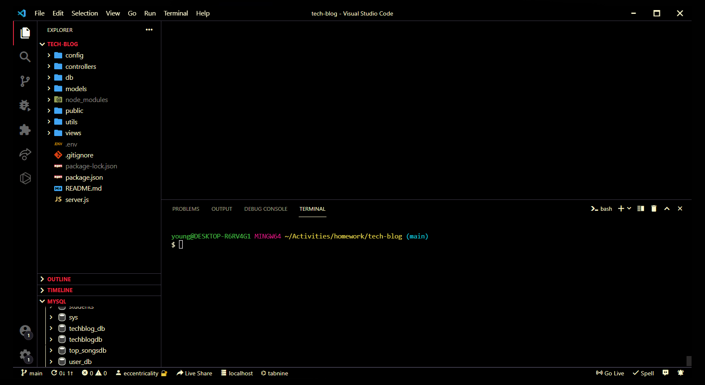

# Tech Blog

User is able to create a new login id. User is able to log in and out of the blog site. User is able to comment on existing posts. User is able to create a new post with title and message. User is able to edit their post. User is able to delete their post.
## Demo

## Lessons Learned

Old lessons covering MVC. It is the foundational point leading into separation of concerns and modularization. Having learned through react and react components by now, it is good to look back to the foundational lessons in separating out the model-view-control.